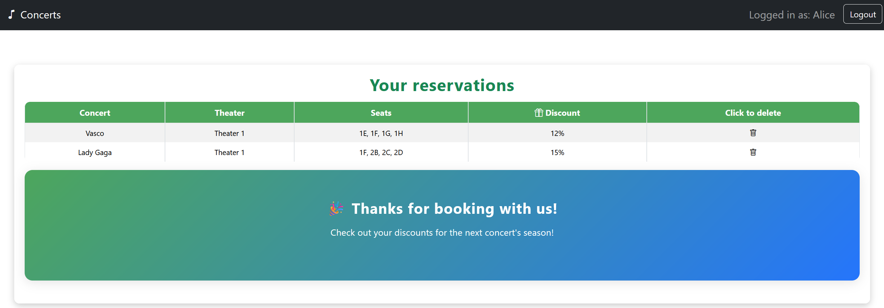
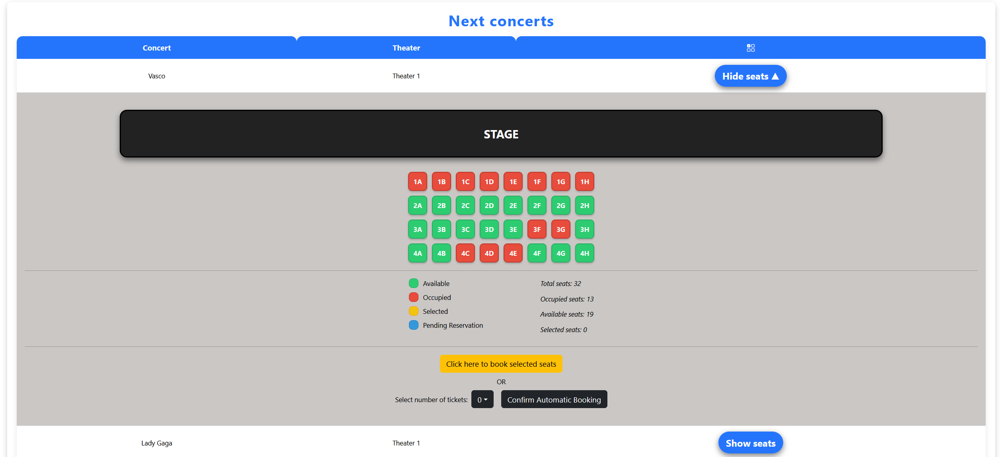

# Exam #3: "Concert seats"
## Student: s322694 RIVA DIEGO

## React Client Application Routes

- Route `/`
    1. When no one is logged in, it displays the navigation bar and the list of concerts. Clicking on "Show seats", the seat map is displayed with the total seats number, the number of occupied seats and the number of available seats. 
    2. When a user is logged in, his reservations are shown on top of the page. Moreover, when "Show seats" is clicked, also the number of selected seats is shown and the user can book tickets. If he clicks on an available seat, it will become yellow and the user can click on the yellow "Click here to book selected tickets" button to book the specific seats he wants; he will then be redirected to the `/confirmation` route. If he wants to book just a number of seats, without regarding of the position, he can pick the number of tickets he wants in the black button on the left and then click on the black "Confirm Automatic Booking" button to book them automatically. 
- Route `/confirmation`\
    It shows a recap of the manual booking. It shows the name of the user, the name of the concert, the name of the theater and all the selected seats. Clicking on the green "Confirm Booking" button will send the request to the server, which will confirm or discard the request based on the requirements of the project. Clicking on the red "Back" button will send the user to the main page.
- Route `/login` \
    It is the page that enables a user to log in, using the email and the password. 

## API Server

### Concerts APIs

* **GET `/api/list-concerts`**: Get all the concerts as a JSON list.
  - **Response body**: 
  ```
  [
    {
      "id": 1,
      "name": "Vasco",
      "theater_id": "1",
      "theater_name": "Theater 1"
    }
    ...
  ]
  ```
  - Codes: `200 OK`, `500 Internal Server Error`

### Theaters APIs

* **GET `/api/get-theater-info/:id`**: get theater info given its id
  - **Parameters**: 
    1. id: an INT $\ge$ 1
    ```
      {
        "id": 1
      }
    ```
  - **Response body**:
    ```
    [
        {
            "id": "1",
            "name": "Theater 1",
            "size": "Small",
            "rows": 4,
            "columns": 8,
            "seats": 32
        }
    ]
    ```
  - Codes: `200 OK`, `422 Unprocessable Content`, `500 Internal Server Error`

### Reservations APIs

* **GET `/api/reservation/:concertId`**: retrieves all the reservations of a certain concert, given its id
  - **Parameters**: 
    1. concertId: an INT $\ge$ 1 
    ```
      {
        "concertId": 1
      }
    ```
  - **Response body**:
    ```
    [
        {
            "reservation_id": 1,
            "concert_id": 1,
            "row": 1,
            "column": "A",
            "user_id": 1
        }
        ...
    ]
    ```
  - Codes: `200 OK`, `422 Unprocessable Content`, `500 Internal Server Error`

* **GET `/api/reservationOfUser/:userId`**: retrieves all the reservations of a certain user, given its id
  - **Parameters**: 
    1. userId as an INT $\ge$ 1
    ```
      {
        "userId": 1
      }
    ```
  - **Response body**:
    ```
    [
        {
            "reservation_id": 1,
            "concert_id": 1,
            "row": 1,
            "column": "A",
            "user_id": 1
        }
        ...
    ]
    ```
  - Codes: `200 OK`, `204 No Content`, `401 Unauthorized`, `422 Unprocessable Content`, `500 Internal Server Error`

* **GET `/api/is-seat-available/:concertID/:row/:column`**: checks if a specific seat is available in a certain concert
  - **Parameters**: 
    1. concertID: an INT $\ge$ 1
    2. row: an INT $\ge$ 1
    3. column: a STRING
    ```
      {
        "concertId": 1
        "row": 1
        "column": "A"
      }
    ```
  - **Response body**:
    If the seat in that concert exists, it retrieves the seat:
    ```
        {
            "row": 1,
            "column": "A",
        }
    ```
    If it doesn't exist, it retrieves null:
    ```
      null
    ```

  - Codes: `200 OK`, `422 Unprocessable Content`, `500 Internal Server Error`

* **POST `/api/create-reservations-entry`**: it creates a reservation in the reservations table
  - **Request body**: 
    - concertID: an INT $\ge$ 1
    - userID: an INT $\ge$ 1
    - seats: an array of seats, where each seat is a 2-character STRING 
    ```
      {
        "concertID": 1,
        "userID": 1, 
        "seats": [ "1A", "2B" ]
      }
    ```
  - **Response body**: if all the reservation are inserted successfully:
    ```
        {
            true
        }
    ```
  - Codes: `201 Created`, `422 Unprocessable Content`, `401 Unauthorized`, `406 Not Acceptable`, `409 Conflict`, `500 Internal Server Error`

* **DELETE `'/api/delete-reservation/:concertId/:userId`**: deletes all the reservations of a user for a specific concert
  - **Request body**: 
    - concertId: an INT $\ge$ 1
    - userId: an INT $\ge$ 1
    ```
      {
        "concertId": 1,
        "userId": 1
      }
    ```
  - **Response body**: if all the reservation are inserted successfully, it returns the number of modified lines in the database.
    
  - Codes: `200 OK`, `422 Unprocessable Content`, `500 Internal Server Error`

### Authentication APIs

* **POST `/api/sessions`**: Authenticate and login the user.
  - **Request**: JSON object with _username_ equal to email:   
    ```
    { "username": "u1@p.it", "password": "pwd" }
    ```
  - **Response body**: JSON object with the user's info, with a specific field to identify if its a loyal one:   
    ```
    { 
      "id": 1
      "email": "u1@p.it", 
      "name": "Alice",
      "loyalty": 1
    }
    ```
  - Codes: `200 OK`, `401 Unauthorized` (incorrect email and/or password).

* **GET `/api/sessions/current`**: Get info on the logged in user.
  - **Response body**: JSON object with the same info as in login:   
    ```
    { 
      "id": 1
      "email": "u1@p.it", 
      "name": "Alice",
      "loyalty": 1 
    }
    ```
  - Codes: `200 OK`, `401 Unauthorized`.

* **DELETE `/api/sessions/current`**: Logout the user.
  - Codes: `200 OK`.

### Token APIs

* **GET `/api/auth-token`**: Returns an auth token the logged in user.
  - **Response body**: JSON object with token
  - **Token payload**: access and authId
    ```
    { access: req.user.loyalty, authId: req.user.id }
    ```
  - Codes: `200 OK`, `401 Unauthorized`.


## API Server2

- **GET `/api/compute-discount`**
  - **Parameters**: 
    1. sum: the sum of the rows in the reservation, as an INT $\ge$ 0
    2. loyal: 1 if the customer is loyal, 0 if it's not loyal, as an INT 
    ```
      { 
        "sum": 10,
        "loyal": 0
      }
    ```
  - **Response body**: the discount value, as an INT
    ```
      { 
        "discount": 12 
      }
    ```
  - Codes: `200 OK`, `422 Unprocessable Content`


## Database Tables

- Table `concerts` - contains id, name, theater_id
- Table `reservations` - contains reservation_id, concert_id, row, column, user_id
- Table `theaters` - contains id, name, size, rows, columns, seats
- Table `users` - contains id, email, name, hash, salt, loyalty

## Main React Components

- `AppWithRouter` (in `App.jsx`): technically a component, takes the role of App and is rendered inside a Router to be able to use the useNavigate hook. This maintains most of the state of the app.
- `GenericLayout` (in `App.jsx`): it is the component where all the other components are.
- `TableLayout` (in `App.jsx`): it is responsible for rendering the concert list and the user's reservation list
- `ReservationTable` (in `Layout.jsx`): it handles the user's reservation table inside the `TableLayout`
- `ConcertsTable` (in `Layout.jsx`): it handles the concert table inside the `TableLayout`
- `LoginLayout` (in `App.jsx`): responsible for handling the login page
- `ConfirmationLayout` (in `App.jsx`): responsible for handling the confirmation page, when the user chooses his seats by clicking on them.
- `Navigation` (in `Layout.jsx`): handles the navigation bar on top of the page


## Screenshots





## Users Credentials

- u1@p.it, pwd
- u2@p.it, pwd
- u3@p.it, pwd
- u4@p.it, pwd
- u5@p.it, pwd
- u6@p.it, pwd

